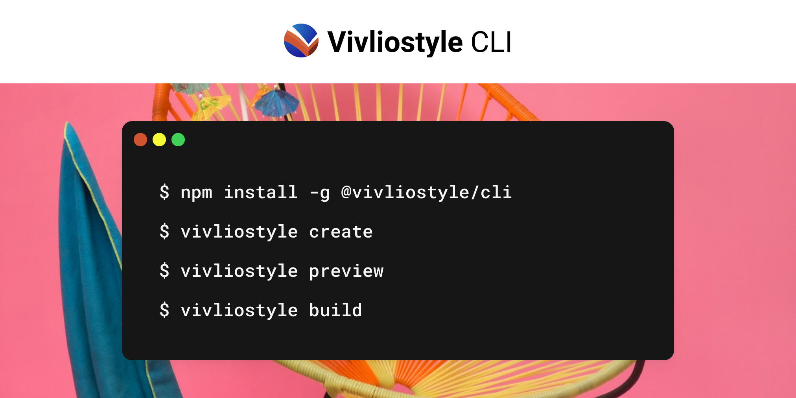

[][npm-url]
[][npm-url]

[npm-url]: https://npmjs.org/package/@vivliostyle/cli

Supercharge your command-line publication workflow.

## Install

```
npm install -g @vivliostyle/cli
```

## Use

```
Usage: vivliostyle [options] [command]

Options:
  -v, --version   output the version number
  -h, --help      display help for command

Commands:
  init            create vivliostyle config
  build           build and create PDF file
  preview         launch preview server
  help [command]  display help for command
```

### `init`

> create vivliostyle config file.

```bash
vivliostyle init
```

You are new to Vivliostyle? Check out our latest project [Create Book](https://github.com/vivliostyle/create-book#readme).
With Create Book, you can easily bootstrap your book project and start writing without any extra effort.

#### CLI Options

```
Options:
  --title <title>            title
  --author <author>          author
  -l, --language <language>  language
  -s, --size  <size>         paper size
  -T, --theme <theme>        theme
  --log-level <level>        specify a log level of console outputs (choices: "silent", "info",
                             "verbose", "debug", default: "info")
  -h, --help                 display help for command
```

### `build`

> build and create PDF file.

Put [vivliostyle.config.js](https://github.com/vivliostyle/create-book/blob/master/templates/default/vivliostyle.config.js) in the root directory, then:

```bash
vivliostyle build
```


#### CLI options

```
Options:
  -c, --config <config_file>         path to vivliostyle.config.js [vivliostyle.config.js]
  -o, --output <path>                specify output file name or directory [<title>.pdf]
                                     This option can be specified multiple, then each -o options can
                                     be supplied one -f option.
                                     ex: -o output1 -f webpub -o output2.pdf -f pdf
  -f, --format <format>              specify output format corresponding output target
                                     If an extension is specified on -o option, this field will be
                                     inferenced automatically.
  -s, --size <size>                  output pdf size
                                     preset: A5, A4, A3, B5, B4, JIS-B5, JIS-B4, letter, legal,
                                     ledger
                                     custom(comma separated): 182mm,257mm or 8.5in,11in
  -m, --crop-marks                   print crop marks
  --bleed <bleed>                    extent of the bleed area for printing with crop marks [3mm]
  --crop-offset <offset>             distance between the edge of the trim size and the edge of the
                                     media size. [auto (13mm + bleed)]
  --css <CSS>                        custom style CSS code. (ex: ":root {--my-color: lime;}")
  --style <stylesheet>               additional stylesheet URL or path
  --user-style <user_stylesheet>     user stylesheet URL or path
  -d, --single-doc                   single HTML document input
  -p, --press-ready                  make generated PDF compatible with press ready PDF/X-1a [false]
                                     This option is equivalent with "--preflight press-ready"
  -t, --timeout <seconds>            timeout limit for waiting Vivliostyle process [120]
  -T, --theme <theme>                theme path or package name
  --title <title>                    title
  --author <author>                  author
  -l, --language <language>          language
  --reading-progression <direction>  Direction of reading progression (choices: "ltr", "rtl")
  --render-mode <mode>               if docker is set, Vivliostyle try to render PDF on Docker
                                     container [local] (choices: "local", "docker")
  --preflight <mode>                 apply the process to generate PDF for printing (choices:
                                     "press-ready", "press-ready-local")
  --preflight-option <options...>    options for preflight process (ex: gray-scale, enforce-outline)
                                     Please refer the document of press-ready for further
                                     information.
                                     https://github.com/vibranthq/press-ready
  --executable-browser <path>        specify a path of executable browser you installed
  --image <image>                    specify a docker image to render
  --http                             launch an HTTP server hosting contents instead of file protocol
                                     It is useful that requires CORS such as external web fonts.
  --viewer <URL>                     specify a URL of displaying viewer instead of vivliostyle-cli's
                                     one
                                     It is useful that using own viewer that has staging features.
                                     (ex: https://vivliostyle.vercel.app/)
  --viewer-param <parameters>        specify viewer parameters. (ex:
                                     "allowScripts=false&pixelRatio=16")
  --proxy-server <proxyServer>       HTTP/SOCK proxy server url for underlying Playwright
  --proxy-bypass <proxyBypass>       optional comma-separated domains to bypass proxy
  --proxy-user <proxyUser>           optional username for HTTP proxy authentication
  --proxy-pass <proxyPass>           optional password for HTTP proxy authentication
  --log-level <level>                specify a log level of console outputs (choices: "silent",
                                     "info", "verbose", "debug", default: "info")
  --ignore-https-errors              true to ignore HTTPS errors when Playwright browser opens a new page
  -h, --help                         display help for command
```

### `preview`

> open preview page and save PDF interactively.

```bash
vivliostyle preview
```

#### CLI options

```
Options:
  -c, --config <config_file>         path to vivliostyle.config.js
  -T, --theme <theme>                theme path or package name
  -s, --size <size>                  output pdf size
                                     preset: A5, A4, A3, B5, B4, JIS-B5, JIS-B4, letter, legal,
                                     ledger
                                     custom(comma separated): 182mm,257mm or 8.5in,11in
  -m, --crop-marks                   print crop marks
  --bleed <bleed>                    extent of the bleed area for printing with crop marks [3mm]
  --crop-offset <offset>             distance between the edge of the trim size and the edge of the
                                     media size. [auto (13mm + bleed)]
  --css <CSS>                        custom style CSS code. (ex: ":root {--my-color: lime;}")
  --style <stylesheet>               additional stylesheet URL or path
  --user-style <user_stylesheet>     user stylesheet URL or path
  -d, --single-doc                   single HTML document input
  -q, --quick                        quick loading with rough page count
  --title <title>                    title
  --author <author>                  author
  -l, --language <language>          language
  --reading-progression <direction>  Direction of reading progression (choices: "ltr", "rtl")
  --executable-browser <path>        specify a path of executable browser you installed
  --http                             launch an HTTP server hosting contents instead of file protocol
                                     It is useful that requires CORS such as external web fonts.
  --viewer <URL>                     specify a URL of displaying viewer instead of vivliostyle-cli's
                                     one
                                     It is useful that using own viewer that has staging features.
                                     (ex: https://vivliostyle.vercel.app/)
  --viewer-param <parameters>        specify viewer parameters. (ex:
                                     "allowScripts=false&pixelRatio=16")
  --browser <browser>                EXPERIMENTAL SUPPORT: Specify a browser type to launch
                                     Vivliostyle viewer [chromium]
                                     Currently, Firefox and Webkit support preview command only!
                                     (choices: "chromium", "firefox", "webkit")
  --proxy-server <proxyServer>       HTTP/SOCK proxy server url for underlying Playwright
  --proxy-bypass <proxyBypass>       optional comma-separated domains to bypass proxy
  --proxy-user <proxyUser>           optional username for HTTP proxy authentication
  --proxy-pass <proxyPass>           optional password for HTTP proxy authentication
  --log-level <level>                specify a log level of console outputs (choices: "silent",
                                     "info", "verbose", "debug", default: "info")
  --ignore-https-errors              true to ignore HTTPS errors when Playwright browser opens a new page
  -h, --help                         display help for command
```

## User Guide

See [User Guide](https://docs.vivliostyle.org/#/vivliostyle-cli)

## Contribute

See [Contribution Guide](CONTRIBUTING.md).

[](https://sourcerer.io/fame/uetchy/vivliostyle/vivliostyle-cli/links/0)[](https://sourcerer.io/fame/uetchy/vivliostyle/vivliostyle-cli/links/1)[](https://sourcerer.io/fame/uetchy/vivliostyle/vivliostyle-cli/links/2)[](https://sourcerer.io/fame/uetchy/vivliostyle/vivliostyle-cli/links/3)[](https://sourcerer.io/fame/uetchy/vivliostyle/vivliostyle-cli/links/4)[](https://sourcerer.io/fame/uetchy/vivliostyle/vivliostyle-cli/links/5)[](https://sourcerer.io/fame/uetchy/vivliostyle/vivliostyle-cli/links/6)[](https://sourcerer.io/fame/uetchy/vivliostyle/vivliostyle-cli/links/7)

## License

Licensed under [AGPL Version 3](http://www.gnu.org/licenses/agpl.html).
