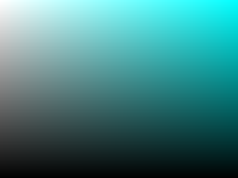

# CMYK

You can output CMYK color PDFs using the `device-cmyk()` CSS function. To enable CMYK support, set `pdfPostprocess.cmyk` to a truthy value (either `true` or a configuration object) in vivliostyle.config.js. Under the hood, this feature works by predicting the PDF operators that Chromium produces and replacing them in a post-processing step. Text, borders, background colors, and SVG vector elements are the typical targets of this conversion.

<span class="k100">K100</span> <span class="k80">K80</span> <span class="k60">K60</span> <span class="k40">K40</span> <span class="k20">K20</span> <span class="c100">C100</span> <span class="c80">C80</span> <span class="c60">C60</span> <span class="c40">C40</span> <span class="c20">C20</span> <a href="#">link</a> <span style="font-family: 'Noto Sans JP'">Noto Sans JPによるType 3に変換された日本語テキスト</span>

Several additional features are provided to help produce fully CMYK PDFs.

## `cmyk.reserveMap`

SVG vector elements can be converted to CMYK, but `device-cmyk()` values within SVG's own CSS or attributes are not processed by Vivliostyle. More fundamentally, SVG editing software such as Adobe Illustrator and Inkscape does not support CMYK colors in SVG[^svg-cmyk]. Whether you are creating an SVG from scratch or converting from a CMYK-capable vector format like PDF or Illustrator's native format, you need a way to reserve specific RGB colors to be converted to designated CMYK colors. That is what `cmyk.reserveMap` provides.

[^svg-cmyk]: Technically, SVG can use any color expression that CSS allows, so SVG does support CMYK insofar as `device-cmyk()` exists. In practice, however, it is unlikely that CMYK SVGs will become common given the limited adoption of `device-cmyk()`.

shapes.svg is an SVG file designed to use C50, K50, and C50+K50, colors not used elsewhere in the CSS. The chosen RGB placeholders are `#80ffff` for C50, `#808080` for K50, and `#408080` for C50+K50. These particular values are arbitrary; any values that don't collide with other colors in the document will work. They are then registered in `cmyk.reserveMap` as shown in the example config, enabling CMYK colors for vector elements inside SVG.


## `replaceImage`

Raster images are not covered by the color conversion described above. `replaceImage` lets you substitute raster images with CMYK-ready versions. Since this feature is not specific to CMYK, it is placed outside the `cmyk` configuration.

Images used in Vivliostyle must be displayable by a web browser. You reference an RGB image in your manuscript and specify the replacement via `replaceImage`, so that the final PDF output contains the CMYK image. The `source` field accepts a regular expression, so managing files by prefix/suffix or separate directories is recommended. Note that JPEG is a raster format that supports CMYK and can be displayed in web browsers[^tiff], but when a CMYK JPEG is included in a web page, Chromium internally converts it to RGB before embedding it in the PDF. The resulting color values are unpredictable, making CMYK JPEGs unsuitable for this purpose.

[^tiff]: TIFF also supports CMYK, but it can only be displayed in Safari. Since Vivliostyle's CMYK feature depends on Chromium-specific behavior, TIFF is excluded here.

ck_cmyk.tiff is a cyan-and-key-plate gradient. Its RGB conversion is saved as ck_rgb.png, which the manuscript references. At PDF output time, ck_rgb.png is replaced with the contents of ck_cmyk.tiff.



The `replaceImage` array is processed front to back; the first entry that matches a given image wins. File-based replacement works by comparing pixel data, so it requires the original image stream to be preserved in the PDF. Simple resizing keeps the stream intact, but complex operations like filters or `object-view-box` cropping may cause the browser to rasterize the image, producing different pixel data. Images loaded from URLs also cannot be matched because no local source file exists. Additionally, images with semi-transparent pixels are not supported; only fully opaque RGB images (not RGBA) can be matched.

### `ReplaceFunction` and `builtinCmykConversion` / `builtinGrayConversion`

For images that cannot be matched by pixel comparison, `replaceImage` also accepts a `ReplaceFunction`, a function that receives an image context and returns replacement image bytes. A bare `ReplaceFunction` placed in the array matches all RGB images (equivalent to `source: *`), so it should come last as a fallback after file-based entries.

The manuscript includes two cases where file-based matching fails. The first is an image loaded from a URL, where no local file exists to compare against:


The second is ck_rgb.png, cropped with `object-view-box: xywh(1px 0 100px 100px)`. The browser rasterizes the cropped region into new pixel data that no longer matches the original file. Whether rasterization occurs is an opaque browser implementation detail; for instance, changing `x` to `50px` happens to preserve the original stream in the current version of Chromium.

{style="object-view-box: xywh(1px 0 100px 100px)"}

In both cases, the `builtinGrayConversion` fallback at the end of the `replaceImage` array converts the image to grayscale. See `vivliostyle.config.js` in this example for the full configuration.

A `ReplaceFunction` can also be used as the `replacement` in a `{ source, replacement }` entry. This is useful for images like screenshots where CMYK accuracy is not critical: preparing a separate CMYK file for each one is unnecessary busywork that also creates a second copy to keep in sync, when an automatic conversion would suffice.

`builtinCmykConversion` and `builtinGrayConversion` are `ReplaceFunction` implementations that convert RGB images to CMYK or grayscale.

A `ReplaceFunction` only receives RGB images; non-RGB images are skipped.

## Other options

By design, this feature cannot produce PDFs that freely mix RGB and CMYK colors (more precisely, it can produce a PDF with unconverted RGB values left in place, but it cannot guarantee that arbitrary RGB and CMYK values will coexist correctly). Since stray RGB elements are usually undesirable in a CMYK workflow, `cmyk.warnUnmapped` (default: `true`) logs warnings for any RGB colors in the PDF that have not been mapped to CMYK.

Similarly, `cmyk.warnUnreplacedImages` (default: `true`) logs warnings for any non-CMYK images remaining in the PDF after image replacement.

Building this example produces unmapped color warnings from the `<hr>` element in the footnote section (`#2b2b2b`, `#9a9a9a`, `#eeeeee`). The correct fix would be to style `hr` with `device-cmyk()`, but here we use `cmyk.overrideMap` to demonstrate how to forcibly replace unmapped RGB colors with CMYK values and keep the output fully CMYK.

This CMYK feature assumes that you are aware of and in control of every colored element in your document. For complex documents, that may not always be the case. `cmyk.overrideMap` is a last resort for silencing `cmyk.warnUnmapped` warnings: it forcibly replaces any remaining RGB values in the PDF with the specified CMYK values.

`mapOutput` is primarily a debugging tool. It writes the internal color mapping table to a file.

```shellsession
$ npm run build && gs -dQUIET -dBATCH -dNOPAUSE -sOutputFile=- -sDEVICE=ink_cov output.pdf

INFO Start building
INFO Launching PDF build environment
INFO Building pages
INFO Building PDF
INFO Processing PDF
INFO Converting CMYK colors
INFO Replacing images
SUCCESS Finished building output.pdf
📙 Built successfully!
 0.34246  0.00000  0.00000  4.31122 CMYK OK
 2.52962  0.00000  0.00000  6.10935 CMYK OK
 9.80958  0.00000  0.00000 12.63330 CMYK OK
 0.26049  0.00000  0.00000 11.36965 CMYK OK
 0.26049  0.00000  0.00000  4.06668 CMYK OK
 0.26049  0.00000  0.00000  4.91960 CMYK OK
 0.28051  0.00000  0.00000  3.23283 CMYK OK
```
