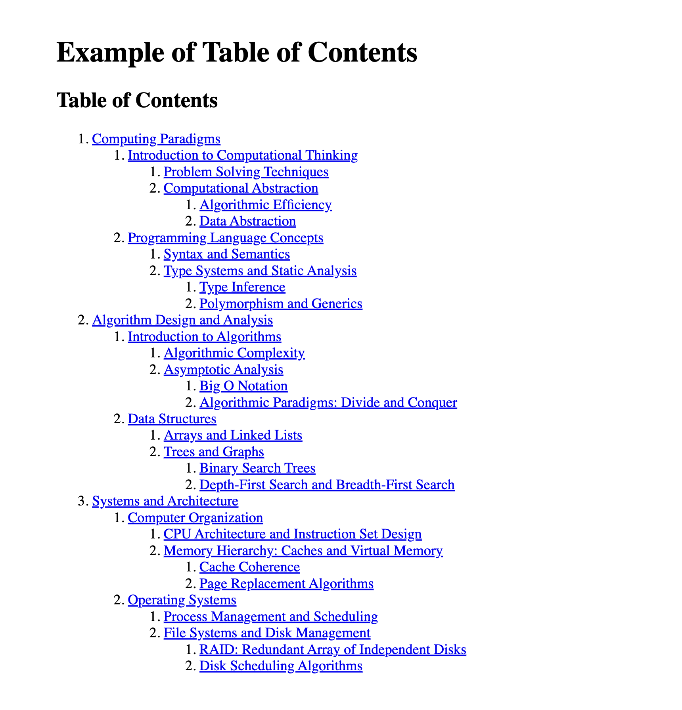

# Example of Table of Contents



With the `toc` option, we can generate a file with a table of contents. The `toc` option can be a string, boolean or an object with the following properties.

- `title`: Specify the title of the generated ToC document. (default: Table of Contents)
- `htmlPath`: Specify the location where the generated ToC document will be saved. (default: index.html)
- `sectionDepth`: Specify the depth of the section to be included in the ToC document. (default: 0)
- `transformDocumentList`, `transformSectionList`: Specify the transform function to be used when generating the ToC document.

#### vivliostyle.config.js

```js
module.exports = {
  title: 'Example of Table of Contents',
  author: 'spring-raining',
  language: 'en',
  size: 'A4',
  entry: [
    './manuscript/01_Computing Paradigms.md',
    './manuscript/02_Algorithm Design and Analysis.md',
    './manuscript/03_Systems and Architecture.md',
  ],
  output: 'draft.pdf',
  toc: {
    title: 'Table of Contents',
    htmlPath: 'index.html',
    sectionDepth: 4,
  },
};
```
