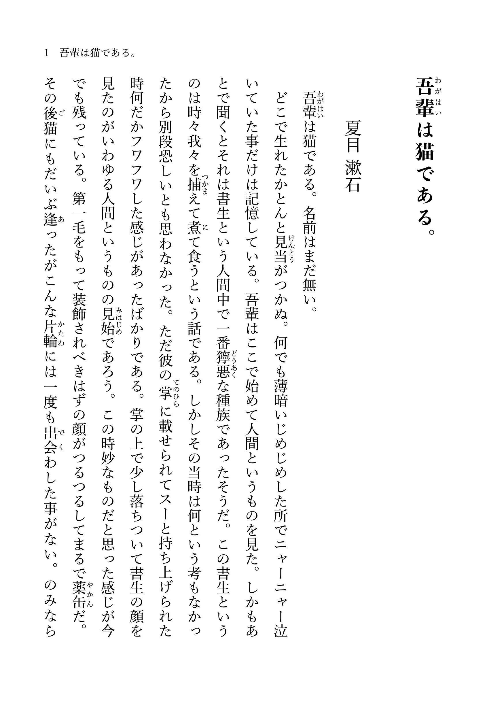

# Preset theme



Vivliostyle provides various themes which has a name starts with `@vivliostyle/theme-`. By setting a `theme` option, we can apply these themes.

If you're exploring the available themes, please check the themes repository! 👉 https://github.com/vivliostyle/themes

#### vivliostyle.config.js

```js
module.exports = {
  title: 'Draft with the preset theme',
  author: 'spring-raining',
  language: 'ja',
  size: 'JIS-B6',
  theme: '@vivliostyle/theme-bunko',
  entry: 'bunko.md',
  output: 'bunko.pdf',
};
```
