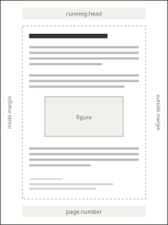

# Figures and Tables

Figures and tables are numbered automatically and can be referenced from the text.

## Figures

An image written on its own line with alternative text becomes a figure with a caption, as shown in . The empty `<a data-ref="fig">` element in the previous sentence is filled with the number of the figure it links to.

{id="fig-layout"}

A theme decides the size of the figure, the alignment of the caption, and whether the figure may be split across pages.

## Tables

Markdown tables become `<table>` elements. A paragraph with the class `tbl-caption` placed before a table gives it a numbered caption, as in .

Common paper sizes

| Name     |  Width | Height |
| :------- | -----: | -----: |
| A4       | 210 mm | 297 mm |
| A5       | 148 mm | 210 mm |
| B5 (JIS) | 182 mm | 257 mm |
| Letter   | 8.5 in |  11 in |

Check the borders, the padding of the cells, and the style of the header row, and try a table that is too wide for the page.
